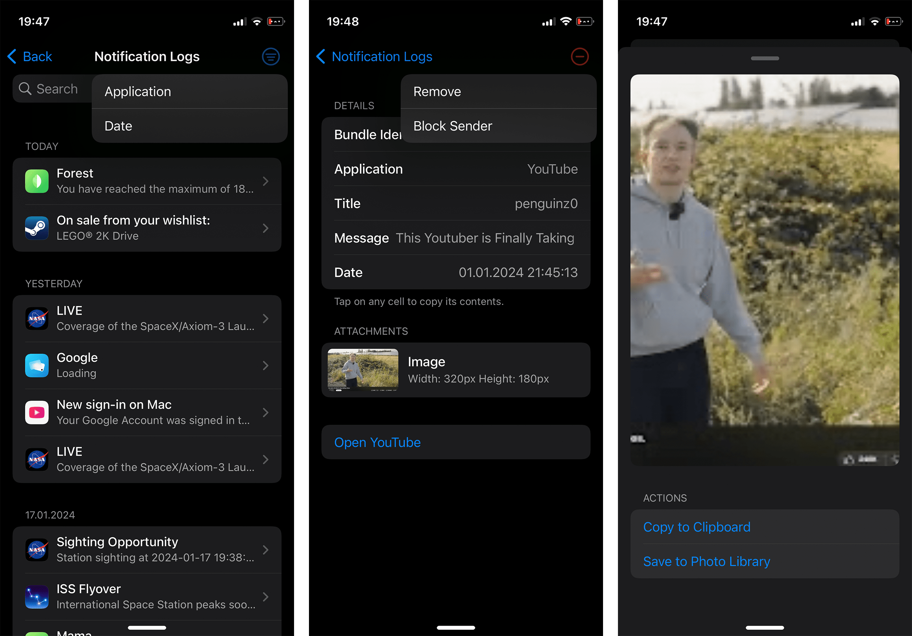

# VE Enhanced
Enhanced notification logger with notification forwarding capabilities.

## About
This is a fork of [Ve](https://github.com/rrk567301/Ve) with added notification forwarding features. The original Ve is a natively integrated notification logger for jailbroken iOS devices.

## New Features in VE Enhanced
- **Bark Integration**: Forward notifications to Bark server with encryption support
- **iTunes API Integration**: Fetch app icons automatically for forwarded notifications
- **Enhanced Security**: Encrypted message forwarding with custom keys
- **Smart Filtering**: Advanced notification level mapping (Active/Passive)

## Preview

## Installation
1. Build the project or download the latest `deb` from releases
2. Install the `deb` using your preferred method
3. Configure Bark settings in Preferences to enable notification forwarding

## Configuration
### Bark Forwarding Setup
1. Open Settings → VE Enhanced
2. Enable "Bark Forwarding" 
3. Enter your Bark API Key
4. Optionally set an encryption key for secure forwarding

## Compatibility
iPhone, iPad and iPod touch running iOS/iPadOS 14 or later with rootless jailbreak.

## Compiling
- [Theos](https://theos.dev/) is required to compile the project
- Edit the root `Makefile` to use your Theos SDK
- Run `make package` to build

## Credits
- **Original Project**: [Ve by Alexandra Aurora Göttlicher, 74k1_](https://github.com/rrk567301/Ve)
- **Enhanced by**: Wing CHAN
- **Source Code**: [https://github.com/WingCH/Ve](https://github.com/WingCH/Ve)

## License
[GPL-3.0](https://github.com/WingCH/Ve/blob/main/COPYING)
