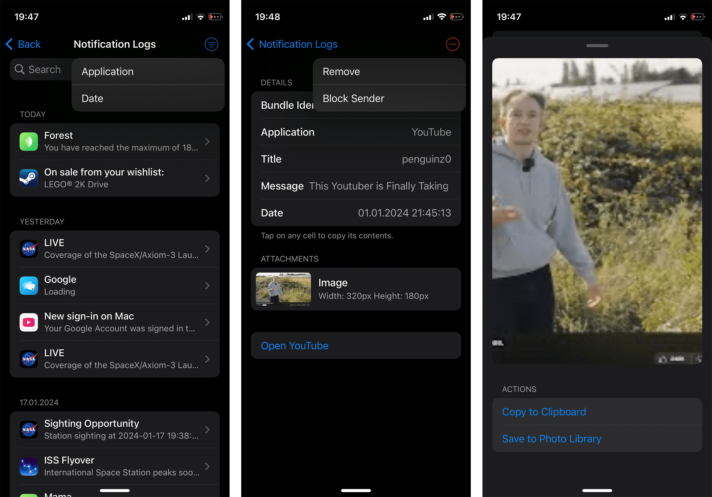

# VE Enhanced
Enhanced notification logger with notification forwarding capabilities.

## About
This is a fork of [Ve](https://github.com/rrk567301/Ve) with added notification forwarding features. The original Ve is a natively integrated notification logger for jailbroken iOS devices.

## New Features in VE Enhanced
- **Bark Integration**: Forward notifications to Bark server with encryption support
- **iTunes API Integration**: Fetch app icons automatically for forwarded notifications
- **Enhanced Security**: Encrypted message forwarding with custom keys
- **Smart Filtering**: Advanced notification level mapping (Active/Passive)
- **可選 AI 篩選**：支援 Clef／Jev 的 System One 協定、自訂 provider endpoint／prompt、逐條人工修正與後續 context。

## Preview


## Installation
1. Build the project or download the latest `deb` from releases
2. Install the `deb` using your preferred method
3. Configure Bark settings in Preferences to enable notification forwarding

## Configuration
### Bark Forwarding Setup
1. Open Settings → VE Enhanced
2. Enable "Bark Forwarding" 
3. Enter your Bark API Key
4. Optionally set an encryption key for secure forwarding

### AI 判斷與人工修正（2.3.0）

在 Settings → Notifications → **VE Enhanced Settings** 開啟 AI 區域；同頁 **Notification Logs** 可查看判斷及修正。既有 PreferenceLoader 入口仍保留。

AI 是可選功能。未設定 token 或關閉 AI 時，直接沿用 Bark。啟用後預設先觀察；你可切換至攔截模式，調整等待秒數與略過門檻。Cloudflare 可選 Clef／Clef-flash，Jev／System One 可設定模型名稱、完整 endpoint URL 與各自 token。

全域 prompt 可編輯及還原。每次判斷帶同一 App 最近 10 條人工修正，最新版 prompt 優先。紀錄保存 AI 原判斷、轉發動作及人工標籤；修正不自動補發。刪除通知仍保留修正例子，可另外清除；Reset All Data 會清除它們。

本輪 vphone 測到的是實際通知／HTTP／UI，模型回覆使用本機 fixture。真實 Clef／Jev 的判斷準確率與 rootless 實機仍待驗證。[設計及驗證界線](docs/clef-notification-filter-design.md)。

### AI 設定介面修正（2.3.1）

新增設定及編輯頁統一使用英文。模型、token 及連線欄位按 provider 顯示；Jev 不顯示 Cloudflare 模型或 Account ID。Cloudflare 標準 endpoint 保留所需 Account ID，完整自訂 URL 不使用 `{account_id}` 時隱藏該欄位。原有 token、模型、URL 與自訂 prompt 保留。

### Notification Logs 英文介面（2.3.2）

通知列表、AI 狀態、詳細頁、修正及補發介面統一使用英文。通知內容及使用者填寫的修正原因保留原文。詳細頁顯示當次的 Skip score 與 Skip threshold。新 AI 和 Bark 請求另提供 AI API Raw Data 與 Bark API Raw Data 兩個入口，可查看及複製 request、response、HTTP status 與 transport error。AI 頁只顯示 AI 呼叫；Bark 頁合併自動轉發及手動補發。2.3.2 原有 capture 會遮蔽憑證並限制 body 為 16 KiB；2.3.4 改為下述完整 capture，舊紀錄不會補造。

Skip threshold 是略過通知的分數門檻。Filter 模式在分數大於或等於門檻時略過轉發，其他分數照常轉發。預設 0.9 表示略過分數至少 0.9 才攔截，並不代表實際準確率達 90%。Observe 模式仍照常轉發。

### Notification Logs 開頁載入（2.3.3）

先完成列表轉場，再在背景讀取及排序紀錄。主線程使用已準備的列表快照，刷新期間保留目前內容；搜尋／排序改變時，舊結果不會覆寫新選擇。API raw data 分為 AI、Bark 兩頁，Bark 的自動轉發及補發放在同一頁。

### 完整追溯及修正 context（2.3.4）

新紀錄保存 App 交給 NSURLSession 的 request body，以及 completion 收到的 response body。完整 bytes 以 Base64 保存，UTF-8 body 同時保留原文；不解析再重建 JSON、不遮蔽 token／URL／headers、不截斷 body。Raw Data 頁直接顯示原文，Copy 可選完整 trace、JSON archive 或各次 request／response body。JSON archive 只是可還原 bytes 的外層容器。原有 Bark 加密仍執行，capture 保存的是實際送出的 ciphertext。headers 是 NSURLSession 可取得的欄位，capture 範圍為 App 的 API 資料。舊版已截斷或遮蔽的內容無法還原，介面會標示 legacy capture。

政策與修正例子保留在 state。官方原文：「examples」— [TypeSafe State](https://docs.typesafe.ai/concepts/state#state-can-be-a-simple-string-or-a-structured-json-value)，來源直接列明 state 可包含例子。instructions 改為明確引用 `notification`、`current_policy.rules`、`corrected_examples`，並完整說明 `should_forward` 與 skip 答案的相反方向。每次仍選同 App 最新 10 條修正，最新規則優先。這是 inference context，沒有訓練模型權重；詳見[官方及 SDK 交叉核對](docs/jev-instructions-and-raw-trace-review.md)。

預設規則及判斷問題加入明確詐騙、欺詐、釣魚企圖。真正的交易、驗證碼、防詐騙警報及只是討論詐騙的訊息仍應保留。既有舊預設規則會採用更新版本，自訂 prompt 保留且可明確指定例外。Filter 模式仍按分數門檻攔截；Observe 模式、資料不足、失敗及逾時仍轉發。

## Compatibility

- 標準 rootless：支援 iOS/iPadOS 14 或以上，package architecture 為 `iphoneos-arm64`。
- Relaxin／RootHide：自 v2.2 起支援，使用獨立 `roothide` scheme 產生 `iphoneos-arm64e` package，並已完成 Relaxin 真機實驗驗證。
- 標準 rootless 與 Relaxin packages 不可互換；安裝前必須核對 `.deb` 的 architecture。

## Compiling

每次切換 package scheme 前都必須 clean，並保留兩個獨立 release artifacts：

```sh
# 標準 rootless；使用 upstream Theos
make clean package FINALPACKAGE=1 THEOS_PACKAGE_SCHEME=rootless

# Relaxin／RootHide；必須使用 roothide/theos
THEOS=/absolute/path/to/roothide-theos make clean package FINALPACKAGE=1 THEOS_PACKAGE_SCHEME=roothide
```

RootHide build 需要 [roothide/theos](https://github.com/roothide/theos)，不能由只含 `rootless` scheme 的 upstream Theos 產生。兩個 `.deb` 應在 release 名稱中清楚標示 `rootless` 或 `roothide-relaxin`，避免安裝錯誤版本。

詳細技術依據、限制與真機 smoke-test 清單見 [Relaxin jailbreak 相容性研究](docs/relaxin-jailbreak-research.md)。

## Regression Tests

```sh
bash tests/resolve-bootstrap-command-test.sh
bash tests/install-to-device-test.sh
bash tests/relaxin-support-contract-test.sh
bash tests/notification-replay-test.sh
bash tests/ai-filter-test.sh
python3 tests/ai-settings-contract-test.py
```

通知重播測試會先儲存通知，再由另一個 process 讀取，驗證重啟後的重播、通知更新及同一時間的不同通知。此測試需要 macOS Foundation，或 Linux 的 Clang、GNUstep Foundation 及 Objective-C development headers；非標準安裝可用 `GNUSTEP_PREFIX` 和 `OBJC_INCLUDE_DIR` 指定路徑。

2.2.3 改用穩定的 publisher ID 比對 respring 重播，並保留新內容、新日期及不同通知的正常轉發。指定 vphone 的實際通知／HTTP 驗證已通過；詳見 [重播修正及驗證](docs/respring-notification-replay.md)。

## vphone 測試的通知權限

Ve 測試 App 的通知 Allow 由測試流程處理，使用者無須逐次點擊。授權階段先使用 sandbox-signed fixture；取得通知權限後，才使用可存取全域測試設定的版本。

`scripts/vphone-allow-notifications.py` 只處理指定 machine 及 App 的通知提示。它使用本機 Tesseract 讀取 vphone screenshot，定位 Allow，並以 fixture 新寫出的 `permission.json` 核對 `granted: true`。其他 App、相機等提示或不明確的按鈕不會點擊。已授權時直接沿用權限。

```sh
python3 scripts/vphone-allow-notifications.py \
  --machine iOS-26.6.2 \
  --bundle-id codes.wingchan.ve-ai-runtime-test \
  --app-name 'Ve AI Runtime Test' \
  --result-path '<apps.data_dir 回傳的 data_path>/Documents/permission.json'

python3 tests/vphone-notification-permission-test.py
```

測試 App 的 Grant Notification Permission 按鈕只要求通知權限，不發送通知或修改 Ve 設定。測試後還原 Ve 設定，並重用測試 App，減少重新安裝後再次出現授權提示。

## Credits
- **Original Project**: [Ve by Alexandra Aurora Göttlicher, 74k1_](https://github.com/rrk567301/Ve)
- **Enhanced by**: Wing CHAN
- **Source Code**: [https://github.com/WingCH/Ve](https://github.com/WingCH/Ve)

## License
[GPL-3.0](https://github.com/WingCH/Ve/blob/main/COPYING)
